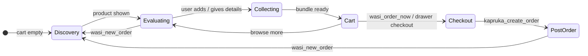
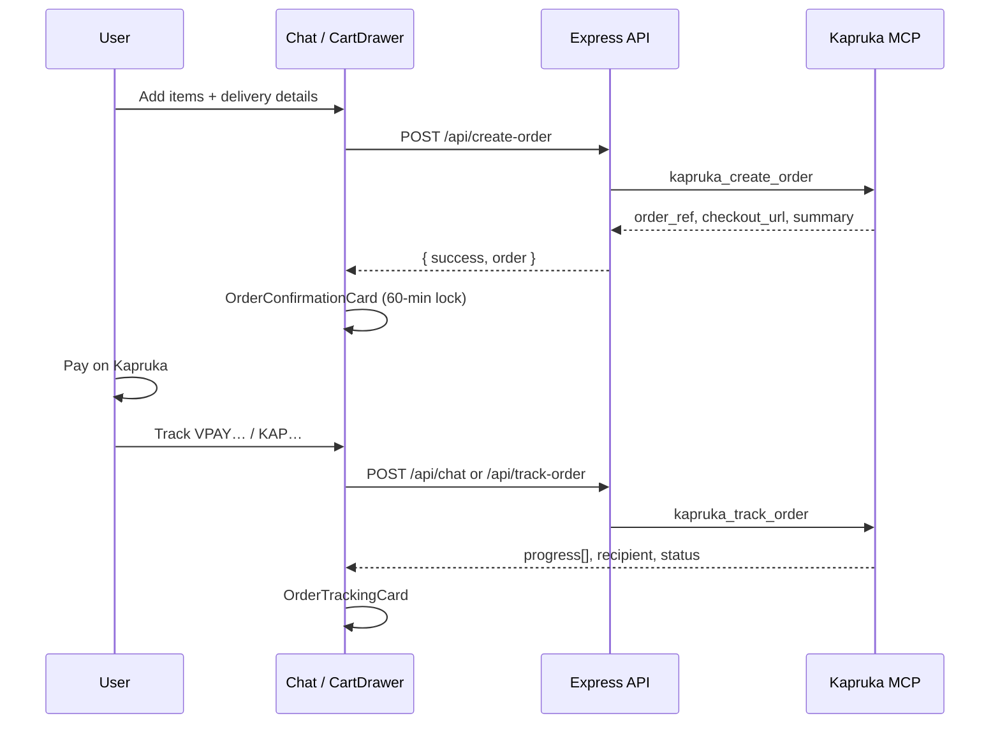

# Wasi — AI Shopping Concierge for Kapruka

Wasi is a trilingual, multimodal shopping assistant built on Kapruka's live MCP API. Users discover gifts, compare products, build a bundle, validate delivery to any Sri Lankan city, lock prices, and pay on Kapruka — through natural conversation in English, Sinhala, Tamil, or mixed Singlish.

**Live demo:** https://wasi-etpz.onrender.com 

---

## What Wasi Does

| Capability | Detail |
|------------|--------|
| Product discovery | Search 120,000+ Kapruka SKUs with budget bands, category filters, pagination, and multi-currency pricing |
| Visual browsing | Category grid (64+ categories), subcategory drill-down, inline product detail, side-by-side comparison |
| Conversational checkout | Recipient, city, phone, address, date, and gift message captured from chat — not a static form |
| Delivery validation | Real-time availability and fee checks; perishable warnings for cakes and flowers |
| Price lock | 60-minute Kapruka checkout window with countdown, renew, copy link, and WhatsApp share |
| Post-payment tracking | Timeline card with recipient, gift message, delivery photo/video flags |
| Multimodal input | Text, voice (STT), and image upload (vision-guided search) |
| Persistence | Guest sessions and signed-in users; cart and chat history in Supabase |

---

## Orchestration Model

Wasi runs a **dual-layer state machine** tuned for gift-commerce: a six-state decision engine in the system prompt, synchronized with client-side chat phases and rich UI cards.

1. **Prompt-defined state machine** — governs every turn: Discovery → Evaluating → Collecting → Cart → Checkout → Post-order.
2. **LLM function calling** — Gemini (default) selects from 20 declared tools per turn, with parallel execution where safe.
3. **Client-side action dispatch** — tool results map directly to React state and purpose-built cards (products, cart, checkout, tracking).

Every transition is observable in server logs. Latency stays low because commerce calls hit Kapruka MCP only when needed; UI mutations run through lightweight virtual tools on the client.

### Conversation state machine (prompt layer)



### Client chat phases (UI layer)

`ChatSection` derives a simpler phase for quick-reply chips:

| Phase | Trigger | Example quick picks |
|-------|---------|----------------------|
| `discovery` | No products, empty cart | "Birthday gift", "Track my order" |
| `browsing` | Product cards visible | "Add the first one", "Show more options" |
| `cart` | Items in bundle | "Checkout now", "Check delivery" |
| `postorder` | Order confirmation present | "Track my order", "Start a new order" |

---

## Tool Reference (20 total)

### Kapruka MCP tools (7) — live wire to `mcp.kapruka.com`

| Tool | Purpose | Key parameters | UI output |
|------|---------|----------------|-----------|
| `kapruka_search_products` | Catalog search | `q`, `category`, `limit`, `max_price`, `min_price`, `sort`, `cursor`, `currency` | Product card strip |
| `kapruka_get_product` | Full product detail | `product_id`, `currency` | Enriched product data / detail card |
| `kapruka_list_categories` | Category tree | `depth` (1 or 2) | Context for browse tools |
| `kapruka_list_delivery_cities` | City fuzzy search | `query` (EN / SI / TA script) | City suggestion chips |
| `kapruka_check_delivery` | Availability + fee | `city`, `delivery_date`, `product_id` | LLM text (drawer uses REST) |
| `kapruka_create_order` | Guest checkout | `cart`, `recipient`, `delivery`, `sender`, `gift_message` | Order confirmation card |
| `kapruka_track_order` | Post-payment tracking | `order_number` (VPAY… / KAP…, not ORD-) | Order tracking timeline card |

### Wasi virtual tools (13) — client-side UI actions

Virtual tools never call Kapruka directly. The server echoes arguments; `App.tsx` applies side effects.

| Tool | Purpose | UI / state effect |
|------|---------|-------------------|
| `wasi_prefill_checkout` | Capture delivery fields from chat | Updates `orderIntent` → CartDrawer form |
| `wasi_add_to_cart` | Consent-gated add to bundle | Supabase cart + badge count |
| `wasi_remove_from_cart` | Remove line item | Cart drawer update |
| `wasi_update_cart_quantity` | Change qty (0 = remove) | Cart drawer update |
| `wasi_get_cart` | Read cart for LLM decisions | LLM-only (no UI) |
| `wasi_get_form_state` | Filled vs missing checkout fields | LLM-only (no UI) |
| `wasi_show_progress` | Pre-operation status line | Italic progress bubble in chat |
| `wasi_order_now` | Trigger checkout | `POST /api/create-order` → confirmation card |
| `wasi_show_product_detail` | Inline rich product card | Deferred message with `product_detail` |
| `wasi_compare_products` | 2–3 product comparison | `ProductComparisonCard` |
| `wasi_show_categories` | Top-level category grid | `CategoryExplorer` |
| `wasi_browse_subcategories` | Subcategory list | `CategoryExplorer` with parent |
| `wasi_new_order` | Reset session | Clear cart + intent |

Tool schemas are canonical in `src/lib/llm-adapter.ts` (`KAPRUKA_TOOL_DECLARATIONS`).

---

## MCP Cache Policy

Client-side TTL cache in `src/lib/mcp.ts` mirrors Kapruka server TTLs to stay within the 60 req/min rate limit.

| Tool | Client TTL | Cached |
|------|-----------|--------|
| `kapruka_list_categories` | 30 minutes | Yes |
| `kapruka_get_product` | 10 minutes | Yes |
| `kapruka_search_products` | 5 minutes | Yes |
| `kapruka_list_delivery_cities` | 24 hours | Yes |
| `kapruka_track_order` | 30 seconds | Yes |
| `kapruka_check_delivery` | — | **No** (real-time slots) |
| `kapruka_create_order` | — | **No** (mutation) |

Additional client caches: in-memory `productCache` (prefetch on search), `sessionStorage` guest ID, `localStorage` active conversation ID. Max MCP cache entries: 500 (FIFO eviction).

### Resilience stack

| Layer | Behavior |
|-------|----------|
| Circuit breaker | 3 consecutive MCP failures → 30s cooldown (60s on HTTP 429) |
| Session recovery | Automatic MCP session re-establishment on 401/406 |
| Simulator fallback | Honest empty search; simulated data for categories/cities/delivery when live is down |
| Loop budget | 8–10 tool iterations max per chat turn |
| Relevance gate | Server + client filtering removes off-category search results |

---

## Client Architecture

### Stack

| Layer | Technology |
|-------|------------|
| Frontend | React 19, TypeScript, Vite 6, Tailwind CSS 4 |
| Server | Express (`server.ts`), single process serves API + Vite in dev |
| LLM | Gemini 3.1 Flash-Lite (default); swappable via `LLM_PROVIDER` |
| Database | Supabase (conversations, messages, cart, orders, profiles) |
| Commerce | Kapruka MCP JSON-RPC at `https://mcp.kapruka.com/mcp` |

### Rich message rendering

Each chat message may attach structured data. `ChatSection` renders:

| Message field | Component |
|---------------|-----------|
| `products` | `ProductCard` horizontal strip |
| `product_detail` | Inline glass product card |
| `compare_products` | `ProductComparisonCard` |
| `categories` | `CategoryExplorer` |
| `order_created` | `OrderConfirmationCard` |
| `tracking_result` | `OrderTrackingCard` |
| `city_suggest` | Quick-reply city chips |
| `error` | `ErrorCard` with retry |

Design system: `glass-bubble` surfaces, Kapruka violet palette (`#402970`), Fraunces display + JetBrains Mono data labels. Full tokens in `src/index.css`.

### Order confirmation card states

`OrderConfirmationCard` handles the full checkout lifecycle:

| State | Condition | UI |
|-------|-----------|-----|
| Loading | `isLoading` while create-order in flight | Spinner + skeleton |
| Error | Server/network failure | Red alert + retry |
| Incomplete | MCP returned no ref and no pay URL | Amber warning + retry |
| Active | Valid lock with countdown | Pay CTA + copy + WhatsApp |
| Expired | Timer elapsed | Re-lock button |

Multilingual copy: English, Sinhala, Tamil (`lang` prop on all order/tracking cards).

### End-to-end checkout flow



---

## REST API

| Method | Path | Description |
|--------|------|-------------|
| `POST` | `/api/chat` | Agentic chat with tool loop |
| `GET` | `/api/products` | Product search |
| `GET` | `/api/products/:code` | Product detail |
| `GET` | `/api/categories` | Category tree |
| `GET` | `/api/cities` | City search |
| `POST` | `/api/check-delivery` | Delivery check |
| `POST` | `/api/create-order` | Place order |
| `POST` | `/api/track-order` | Track order |
| `POST` | `/api/stt` | Voice transcription |
| `GET` | `/api/conversations` | List conversations |
| `POST` | `/api/conversations` | Create conversation |
| `GET` | `/health` | Health check |

---

## Local Development

**Prerequisites:** Node.js 20+, npm

```bash
npm install
```

Create `.env` (see variables below):

```bash
GEMINI_API_KEY=your_key
SUPABASE_URL=https://your-project.supabase.co
SUPABASE_SERVICE_KEY=your_service_key
SUPABASE_ANON_KEY=your_anon_key
VITE_SUPABASE_URL=https://your-project.supabase.co
VITE_SUPABASE_ANON_KEY=your_anon_key
LLM_PROVIDER=gemini
```

Start the dev server (Express + Vite on port 3000):

```bash
npx tsx server.ts
```

Open http://localhost:3000

### Verification commands

```bash
# TypeScript
npm run lint

# Live MCP protocol (13 stages)
npm run test:mcp

# Full smoke suite
npm run test:all

# Track a real post-payment order
curl -s -X POST http://localhost:3000/api/track-order \
  -H "Content-Type: application/json" \
  -d '{"order_number":"VPAY827982BA"}'
```

### Database setup

Run `supabase/schema.sql` in the Supabase SQL editor. Tables: `conversations`, `messages`, `cart_items`, `orders`, `profiles`. Hybrid guest/auth RLS model documented in the schema file.

---

## Deployment

Docker + Render configuration in `Dockerfile` and `render.yaml`. Production build:

```bash
npm run build
npm start
```

Health endpoint: `GET /health` returns provider and model name.

---

## Project Structure

```
wasi/
├── server.ts              Express app, system prompt, REST routes, tool router
├── src/
│   ├── App.tsx            Root orchestrator, tool-call pipeline, cart/order state
│   ├── components/        Chat UI, cards, cart drawer, modals
│   ├── hooks/             Supabase chat, cart, auth, conversations
│   ├── lib/
│   │   ├── llm-adapter.ts Tool declarations + multi-provider LLM
│   │   └── mcp.ts         Kapruka MCP client, cache, simulator
│   └── types.ts           Domain models
├── supabase/schema.sql    Database schema
├── tests/mcp-live.test.js Live MCP verification
└── WASI_STRESS_TEST_SHOWCASE.md  Extended feature matrix for judges
```

---

## Multilingual Support

| Aspect | Implementation |
|--------|----------------|
| UI copy | Per-component `LOCALE` objects with `en`, `si`, `ta` keys |
| Fonts | Noto Sans Sinhala / Tamil via `font-sinhala`, `font-tamil` classes |
| LLM replies | Language lock in system prompt; mirrors user script |
| STT | Code-switching preserved (Singlish / Tanglish) |
| City search | MCP accepts English, Sinhala, and Tamil queries |

---

## Key Design Decisions

**Dual-layer orchestration:** The prompt state machine handles conversational logic; the client phase system drives quick replies and card rendering. Both layers stay in sync without extra runtime infrastructure.

**Virtual tools:** Kapruka MCP handles commerce; Wasi virtual tools handle UI mutations (cart, form prefill, progress, category grids) without polluting the MCP schema.

**Dual checkout paths:** Users can checkout from the cart drawer (form-driven) or from chat (`wasi_order_now`). Both hit the same `POST /api/create-order` endpoint with normalized MCP payloads.

**ORD- vs VPAY-:** `ORD-` references are pre-payment price locks from `create_order`. `VPAY…` / `KAP…` numbers from the Kapruka confirmation email are required for `track_order`.

---

## License

Private — Kapruka Agent Challenge submission.
